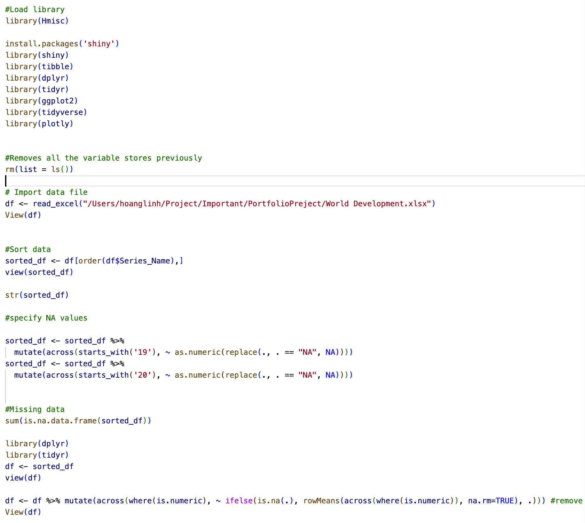

## Introduction

This project was made to showcase my data analysis skills. The project consists of small projects using data cleaning, data wrangling, and data interpretation skills. In this project I used Python, SQL, R, and Tableau.

## Projects

- **COVID-19 Project**: This project involves analyzing COVID-19 data using SQL. It includes data cleaning, querying, and visualization to understand the impact and trends of the pandemic.
  
- **Customer Behaviour**: This project, saved in a .smcl file, involves analyzing customer behavior data. It includes statistical analysis and visualizations to identify patterns and insights.
- **GDP Analysis**: This Jupyter Notebook project involves analyzing GDP data using Python. It includes data manipulation, visualization, and possibly predictive modeling to understand economic trends.
  
- **Interns Satisfaction**: This project, also in a .smcl file, involves analyzing survey data to gauge intern satisfaction. It includes descriptive statistics and visualizations.
- **Movie Industry Analysis**: This Jupyter Notebook project involves analyzing data related to the movie industry. It includes data cleaning, exploratory data analysis, and visualizations to uncover trends and insights.
- **National Accounts**: This R script involves analyzing national accounts data. It includes data manipulation, visualization, and possibly econometric analysis to understand economic indicators.
  

## Technologies Used

- **SQL**: Utilized for data cleaning, querying, and analysis in projects like the COVID-19 project. The projects was using MySQL. 

- **Python**: Employed for data manipulation, visualization, and predictive modeling in projects such as GDP Analysis and Movie Industry Analysis. These projects was using Jupyter Notebook with necessary libraries such as Pandas, Numpy, Matplotlib, and Scikit-Learn.
- **Jupyter Notebook**: Utilized for creating and sharing documents that contain live code, equations, visualizations, and narrative text.

- **Tableau**: Used for creating interactive dashboards and visualizations to present data insights.
- **R**: Used for statistical analysis and data visualization in projects like National Accounts.

- **Stata**: Employed for data analysis, statistical modeling, and visualization in projects like Customer Behaviour and Interns Satisfaction.

## Contact

Email: lily.nguyen129148@gmail.com 
Phone: +447510616587  
Website: https://lily129148.github.io/LilyNguyen.giuthub.io/
